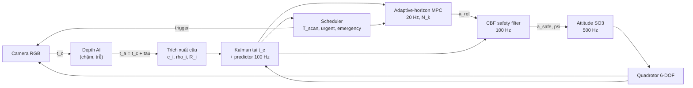

# DART-UAV

**DART — Delay-Aware, Risk-Triggered perception–control co-design** cho quadrotor tránh vật cản bằng monocular depth tần số thấp.
Mô phỏng hoàn toàn bằng **MATLAB/Simulink chạy trên cloud (GitHub Actions)** — không cần cài đặt hay chạy gì ở máy local.

> Tên cũ của dự án: `project1` (bản đề xuất "UAV Perception-Aware Adaptive MPC").
> Tên mới **DART** tóm tắt đúng đóng góp: bù **D**elay của AI, lập lịch perception kích hoạt theo **R**ủi ro (risk-**T**riggered), và horizon MPC thích nghi (**A**daptive).

| | |
|---|---|
| Phương pháp (bản 2, đã hiệu chỉnh) | [`docs/method/DART_method_VI.pdf`](docs/method/DART_method_VI.pdf) (nguồn LaTeX: [`DART_method_VI.tex`](docs/method/DART_method_VI.tex)) |
| Mô hình Simulink | sinh từ mã bởi [`simulink/dart_build_model.m`](simulink/dart_build_model.m) → `dart_closed_loop.slx` |
| Chạy trên cloud | tab **Actions** của repo: `CI`, `Experiments`, `Docs` |

---

## 1. Ý tưởng

Mạng depth monocular chạy chậm (5–15 Hz) và trễ (50–200 ms) so với vòng điều khiển (100 Hz). DART:

1. **Bù trễ**: mỗi ảnh được gắn thời điểm chụp `t_c`; phép đo được chuyển sang khung quán tính bằng pose tại `t_c` và cập nhật Kalman **tại `t_c`**, rồi dự đoán tới hiện tại. Với một inference engine (tối đa một frame đang xử lý) cách làm này *chính xác*, không xấp xỉ.
2. **Lập lịch perception theo an toàn**: khoảng quét `T_scan` được tính từ khoảng cách bảo thủ, tốc độ tiếp cận, khả năng phanh, độ trễ và độ bất định — có thêm ràng buộc **frontier** cho vật cản chưa nhìn thấy. Xa/chậm/chắc chắn → quét thưa; gần/nhanh/bất định → quét dày.
3. **MPC horizon thích nghi**: `N_k` lớn lên theo rủi ro (TTC), quãng phanh, và thời điểm có phép đo kế tiếp; ràng buộc vật cản được lồi hoá bằng nửa không gian tiếp tuyến (đủ an toàn) và tập kết thúc "dừng an toàn".
4. **Lớp an toàn CBF** ở 100 Hz với độ phồng bất định biến thiên theo thời gian. Mặc định là *braking-distance CBF* — dùng **cùng bất đẳng thức dừng** với scheduler.



Danh sách đầy đủ các chỉnh sửa so với bản đề xuất (R1–R11) ở **Mục 1** của tài liệu phương pháp.

## 2. Chạy trên cloud (GitHub Actions)

Mọi thứ chạy trên máy ảo của GitHub. Có ba workflow:

| Workflow | Kích hoạt | Làm gì | Kết quả |
|---|---|---|---|
| **CI** | tự động mỗi lần push | (a) *Octave*: toàn bộ unit test + 1 nhiệm vụ demo — **không cần license**; (b) *MATLAB + Simulink*: unit test, sinh model `.slx`, chạy vòng kín trong Simulink và so sánh chéo với MATLAB engine | Artifact `octave-results`, `matlab-simulink-results` (hình, `.slx`, `summary.md`) + bảng ở trang tóm tắt của run |
| **Experiments** | thủ công: *Actions → Experiments → Run workflow* | Monte-Carlo ablation 7 biến thể × kịch bản × seed; mỗi kịch bản một job song song. Chọn engine `matlab` / `simulink` / `octave` | Artifact `ablation-S1-…`: `runs.csv`, `summary.csv`, `summary.md`, `figures/*.png` |
| **Docs** | khi `docs/**` thay đổi | Biên dịch tài liệu phương pháp bằng XeLaTeX | Artifact `DART-method-pdf` |

### 2.1. License MATLAB trên GitHub Actions (quan trọng)

GitHub Actions cài MATLAB/Simulink qua [`matlab-actions/setup-matlab`](https://github.com/matlab-actions/setup-matlab).

* **Repo public** → MathWorks cấp license tự động, không cần làm gì.
* **Repo private** (như hiện tại) → cần **batch licensing token**:
  1. Đăng ký token tại [MATLAB Batch Licensing Pilot](https://www.mathworks.com/support/batch-tokens.html) (cần tài khoản MathWorks có license MATLAB + Simulink, ví dụ license của trường).
  2. Vào *Settings → Secrets and variables → Actions → New repository secret*, tên **`MLM_LICENSE_TOKEN`**, dán token.
  3. Push bất kỳ — job *MATLAB + Simulink* sẽ chạy.

Khi chưa có license, job MATLAB được **bỏ qua kèm cảnh báo**, còn job Octave vẫn chạy và kiểm tra toàn bộ thuật toán (cùng mã nguồn).

Phương án cloud khác: mở repo trong **MATLAB Online** (trình duyệt) → `dart_setup; run('ci/ci_matlab.m')`.

### 2.2. Chạy ablation

*Actions → Experiments → Run workflow*:

* `engine`: `matlab` (nhanh, khuyến nghị cho Monte-Carlo), `simulink` (dùng model Simulink cho từng lần chạy), `octave` (không cần license, chậm hơn ~3–5×)
* `seeds`: ví dụ `1:10`
* `variants`: `all` hoặc `A_FR_FN,E_DART,F_NODELAY`
* `scenarios`: `["S1","S2","S3"]`

Tải artifact ở cuối trang run; bảng tổng hợp hiển thị ngay trong *Summary* của run.

## 3. Cấu trúc mã nguồn

```
dart_setup.m                  thêm đường dẫn
src/config/                   tham số mặc định, kịch bản S1–S3, biến thể ablation A–G
src/plant/                    quadrotor 6-DOF, bộ điều khiển attitude SO(3) (codegen-compatible)
src/perception/               camera ray-casting, mạng depth tổng hợp, trích xuất cầu, latency, message
src/estimation/               bộ đệm pose, Kalman tại thời điểm chụp, predictor, quên track
src/scheduling/               khoảng mở an toàn, frontier, sự kiện, urgent/emergency
src/control/                  horizon thích nghi, MPC (QP), CBF, yaw, bước điều khiển tích hợp
src/util/                     QP interior-point (thuần MATLAB), tiện ích hình học, RNG
sim/dart_sim.m                MATLAB engine (cùng hàm, cùng đa tần số với Simulink)
simulink/                     System objects + script sinh model + runner Simulink
experiments/                  chạy 1 ca, ablation Monte-Carlo, metric, hình
tests/                        unit test (chạy được trên MATLAB và Octave)
ci/                           điểm vào của các workflow
docs/method/                  tài liệu phương pháp (LaTeX, PDF)
```

Model Simulink `dart_closed_loop.slx`:

| Khối | Loại | Tần số |
|---|---|---|
| Quadrotor 6DOF + Integrator | MATLAB Function (codegen) | liên tục, ode4 2 ms |
| Attitude Controller | MATLAB Function (codegen) | 2 ms |
| DART Controller (tracker, scheduler, MPC, CBF) | MATLAB System `DartControllerSys` (interpreted) | 10 ms (MPC 50 ms bên trong) |
| Camera + Depth AI | MATLAB System `DartPerceptionSys` (không direct feed-through) | 10 ms, theo sự kiện |
| Ground Truth Monitor → Stop | MATLAB System `DartMonitorSys` | 10 ms |

Model được sinh lại từ mã ở mỗi lần CI nên luôn khớp với mã nguồn; *đừng sửa tay file `.slx`*, hãy sửa `dart_build_model.m`.

## 4. Kịch bản và ablation

| Kịch bản | Mô tả |
|---|---|
| S1 | rừng cầu tĩnh theo 3 cụm dọc hành lang 50 m, xen vùng thoáng |
| S2 | vật cản tĩnh thưa + 6 vật cản cắt ngang (0.6–1.5 m/s) |
| S3 | hình học S1, perception chậm và nhiễu (inference 160 ms) |

| Biến thể | Perception | Horizon | Inflation + CBF | Bù trễ |
|---|---|---|---|---|
| A_FR_FN | cố định 10 Hz | cố định N=20 | – | ✓ |
| B_AP_FN | thích nghi | cố định | – | ✓ |
| C_FR_AN | cố định 10 Hz | thích nghi | – | ✓ |
| D_AP_AN | thích nghi | thích nghi | – | ✓ |
| **E_DART** | thích nghi | thích nghi | ✓ | ✓ |
| F_NODELAY | thích nghi | thích nghi | ✓ | – |
| G_FR_LOW | cố định 3 Hz | thích nghi | ✓ | ✓ |

Kết quả sơ bộ — Monte-Carlo nhỏ (3 seed/kịch bản, MATLAB engine chạy trên Octave; trung bình (độ lệch chuẩn)). Bảng đầy đủ 7 biến thể × 10 seed: chạy workflow **Experiments**.

| Kịch bản | Biến thể | Thành công | Va chạm | Clearance thân min [m] | Thời gian [s] | Số suy luận | Năng lượng GPU [J] | Sai số track [m] |
|---|---|---|---|---|---|---|---|---|
| S1 tĩnh | A_FR_FN | 100% | 0% | 0.39 (0.05) | 14.9 (2.3) | 139 (21) | 166 (26) | 0.22 (0.04) |
| S1 tĩnh | **E_DART** | 100% | 0% | **0.59** (0.09) | 17.4 (2.1) | **110** (3) | **134** (3) | 0.30 (0.09) |
| S1 tĩnh | F_NODELAY | 100% | 0% | 0.31 (0.13) | 24.6 (3.0) | 202 (16) | 241 (18) | 1.05 (0.19) |
| S2 động | A_FR_FN | 67% | **33%** | 0.26 (0.23) | – | – | – | 0.65 (0.31) |
| S2 động | **E_DART** | **100%** | 0% | **0.87** (0.39) | 20.0 (8.3) | 124 (49) | 150 (62) | 0.68 (0.10) |
| S2 động | F_NODELAY | 100% | 0% | 0.73 (0.62) | 21.2 (9.5) | 140 (58) | 170 (69) | 1.84 (0.51) |
| S3 trễ lớn | A_FR_FN | 100% | 0% | 0.43 (0.02) | 13.7 (0.2) | 75 (7) | 183 (3) | 0.25 (0.07) |
| S3 trễ lớn | **E_DART** | 100% | 0% | **0.56** (0.10) | 20.6 (6.1) | 92 (27) | 222 (62) | 0.33 (0.07) |
| S3 trễ lớn | F_NODELAY | 67% (1 timeout) | 0% | 0.31 (0.10) | 30.2 (9.4) | 162 (61) | 384 (132) | 1.35 (0.11) |

Đọc nhanh: DART không va chạm lần nào và giữ biên an toàn lớn nhất; ở S1 dùng ít suy luận/năng lượng hơn perception 10 Hz cố định; bỏ bù trễ (F) làm sai số track tăng 3–5 lần và nhiệm vụ chậm hơn rõ rệt (seed đơn lẻ trước khi nới khe hẹp còn cho thấy F va chạm ở S3). Cái giá hiện tại của DART là nhiệm vụ chậm hơn ~15–50% do tính bảo thủ (độ phồng bất định, CBF) — đây là điểm cần đánh giá/tinh chỉnh tiếp bằng Monte-Carlo đầy đủ.

## 5. Tuỳ biến

* Tham số: [`src/config/dart_default_config.m`](src/config/dart_default_config.m) (mọi tham số có chú thích, đơn vị SI).
* Kịch bản mới: thêm `case` trong [`src/config/dart_scenario.m`](src/config/dart_scenario.m).
* Biến thể mới: thêm `case` trong [`src/config/dart_apply_variant.m`](src/config/dart_apply_variant.m) và tên vào `dart_variant_list.m`.
* Dùng `quadprog` thay QP nội bộ: `cfg.mpc.solver = 'quadprog'` (cần Optimization Toolbox).
* Dùng HOCBF của bản đề xuất thay braking-CBF: `cfg.cbf.type = 'hocbf'`.

Trong MATLAB (cloud hoặc local):

```matlab
dart_setup;
res = dart_run_case('E_DART', 'S2', 1, 'simulink');   % hoặc 'matlab'
m = dart_metrics(res); dart_plot_run(res, 'run.png');
run_ablation('scenarios', {'S1'}, 'seeds', 1:5);       % ghi results/ablation
```

## 6. Giới hạn hiện tại

* Mạng depth được thay bằng mô hình sai số tổng hợp trên ảnh depth ray-casting (không render RGB); liên kết dữ liệu dùng định danh instance lý tưởng.
* Vật cản dạng cầu; tường/cột cần hình học khác.
* CBF trên trạng thái ước lượng: an toàn mang tính xác suất qua hệ số `beta_s` (không bảo đảm qua bước nhảy lớn bất thường của cập nhật Kalman).

Chi tiết và các mệnh đề lý thuyết: Mục 12 của tài liệu phương pháp.
