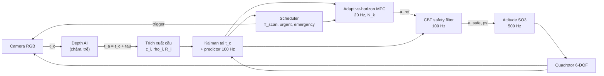

# DART-UAV

**DART — Delay-Aware, Risk-Triggered perception–control co-design** cho quadrotor tránh vật cản bằng monocular depth tần số thấp.
Mô phỏng hoàn toàn bằng **MATLAB/Simulink chạy trên cloud (GitHub Actions)** — không cần cài đặt hay chạy gì ở máy local.

> Tên cũ của dự án: `project1` (bản đề xuất "UAV Perception-Aware Adaptive MPC").
> Tên mới **DART** tóm tắt đúng đóng góp: bù **D**elay của AI, lập lịch perception kích hoạt theo **R**ủi ro (risk-**T**riggered), và horizon MPC thích nghi (**A**daptive).

| | |
|---|---|
| Phương pháp (bản 2, đã hiệu chỉnh) | [`docs/method/DART_method_VI.pdf`](docs/method/DART_method_VI.pdf) (nguồn LaTeX: [`DART_method_VI.tex`](docs/method/DART_method_VI.tex)) |
| Mô hình Simulink | sinh từ mã bởi [`simulink/dart_build_model.m`](simulink/dart_build_model.m) → `dart_closed_loop.slx` |
| Chạy trên cloud | tab **Actions** của repo: `CI`, `Experiments`, `Docs` |

---

## 1. Ý tưởng

Mạng depth monocular chạy chậm (5–15 Hz) và trễ (50–200 ms) so với vòng điều khiển (100 Hz). DART:

1. **Bù trễ**: mỗi ảnh được gắn thời điểm chụp `t_c`; phép đo được chuyển sang khung quán tính bằng pose tại `t_c` và cập nhật Kalman **tại `t_c`**, rồi dự đoán tới hiện tại. Với một inference engine (tối đa một frame đang xử lý) cách làm này *chính xác*, không xấp xỉ.
2. **Lập lịch perception theo an toàn**: khoảng quét `T_scan` được tính từ khoảng cách bảo thủ, tốc độ tiếp cận, khả năng phanh, độ trễ và độ bất định — có thêm ràng buộc **frontier** cho vật cản chưa nhìn thấy. Xa/chậm/chắc chắn → quét thưa; gần/nhanh/bất định → quét dày.
3. **MPC horizon thích nghi**: `N_k` lớn lên theo rủi ro (TTC), quãng phanh, và thời điểm có phép đo kế tiếp; ràng buộc vật cản được lồi hoá bằng nửa không gian tiếp tuyến (đủ an toàn) và tập kết thúc "dừng an toàn".
4. **Lớp an toàn CBF** ở 100 Hz với độ phồng bất định biến thiên theo thời gian. Mặc định là *braking-distance CBF* — dùng **cùng bất đẳng thức dừng** với scheduler.



Danh sách đầy đủ các chỉnh sửa so với bản đề xuất (R1–R12) ở **Mục 1** của tài liệu phương pháp.

## 2. Chạy trên cloud (GitHub Actions)

Mọi thứ chạy trên máy ảo của GitHub. Có ba workflow:

| Workflow | Kích hoạt | Làm gì | Kết quả |
|---|---|---|---|
| **CI** | tự động mỗi lần push | (a) *Octave*: toàn bộ unit test + 1 nhiệm vụ demo — **không cần license**; (b) *MATLAB + Simulink*: unit test, sinh model `.slx`, chạy vòng kín trong Simulink và so sánh chéo với MATLAB engine | Artifact `octave-results`, `matlab-simulink-results` (hình, `.slx`, `summary.md`) + bảng ở trang tóm tắt của run |
| **Experiments** | thủ công: *Actions → Experiments → Run workflow* | Monte-Carlo ablation 7 biến thể × kịch bản × seed; mỗi kịch bản một job song song. Chọn engine `matlab` / `simulink` / `octave` | Artifact `ablation-S1-…`: `runs.csv`, `summary.csv`, `summary.md`, `figures/*.png` |
| **Docs** | khi `docs/**` thay đổi | Biên dịch tài liệu phương pháp bằng XeLaTeX | Artifact `DART-method-pdf` |

### 2.1. License MATLAB trên GitHub Actions (quan trọng)

GitHub Actions cài MATLAB/Simulink qua [`matlab-actions/setup-matlab`](https://github.com/matlab-actions/setup-matlab).

* **Repo public** → MathWorks cấp license tự động, không cần làm gì.
* **Repo private** (như hiện tại) → cần **batch licensing token**:
  1. Đăng ký token tại [MATLAB Batch Licensing Pilot](https://www.mathworks.com/support/batch-tokens.html) (cần tài khoản MathWorks có license MATLAB + Simulink, ví dụ license của trường).
  2. Vào *Settings → Secrets and variables → Actions → New repository secret*, tên **`MLM_LICENSE_TOKEN`**, dán token.
  3. Push bất kỳ — job *MATLAB + Simulink* sẽ chạy.

Khi chưa có license, job MATLAB được **bỏ qua kèm cảnh báo**, còn job Octave vẫn chạy và kiểm tra toàn bộ thuật toán (cùng mã nguồn).

Phương án cloud khác: mở repo trong **MATLAB Online** (trình duyệt) → `dart_setup; run('ci/ci_matlab.m')`.

### 2.2. Chạy ablation

*Actions → Experiments → Run workflow*:

* `engine`: `matlab` (nhanh, khuyến nghị cho Monte-Carlo), `simulink` (dùng model Simulink cho từng lần chạy), `octave` (không cần license, chậm hơn ~3–5×)
* `seeds`: ví dụ `1:10`
* `variants`: `all` hoặc `A_FR_FN,E_DART,F_NODELAY`
* `scenarios`: `["S1","S2","S3"]`

Tải artifact ở cuối trang run; bảng tổng hợp hiển thị ngay trong *Summary* của run.

## 3. Cấu trúc mã nguồn

```
dart_setup.m                  thêm đường dẫn
src/config/                   tham số mặc định, kịch bản S1–S3, biến thể ablation A–G
src/plant/                    quadrotor 6-DOF, bộ điều khiển attitude SO(3) (codegen-compatible)
src/perception/               camera ray-casting, mạng depth tổng hợp, trích xuất cầu, latency, message
src/estimation/               bộ đệm pose, Kalman tại thời điểm chụp, predictor, quên track
src/scheduling/               khoảng mở an toàn, frontier, sự kiện, urgent/emergency
src/control/                  horizon thích nghi, MPC (QP), CBF, yaw, bước điều khiển tích hợp
src/util/                     QP interior-point (thuần MATLAB), tiện ích hình học, RNG
sim/dart_sim.m                MATLAB engine (cùng hàm, cùng đa tần số với Simulink)
simulink/                     System objects + script sinh model + runner Simulink
experiments/                  chạy 1 ca, ablation Monte-Carlo, metric, hình
tests/                        unit test (chạy được trên MATLAB và Octave)
ci/                           điểm vào của các workflow
docs/method/                  tài liệu phương pháp (LaTeX, PDF)
```

Model Simulink `dart_closed_loop.slx`:

| Khối | Loại | Tần số |
|---|---|---|
| Quadrotor 6DOF + Integrator | MATLAB Function (codegen) | liên tục, ode4 2 ms |
| Attitude Controller | MATLAB Function (codegen) | 2 ms |
| DART Controller (tracker, scheduler, MPC, CBF) | MATLAB System `DartControllerSys` (interpreted) | 10 ms (MPC 50 ms bên trong) |
| Camera + Depth AI | MATLAB System `DartPerceptionSys` (không direct feed-through) | 10 ms, theo sự kiện |
| Ground Truth Monitor → Stop | MATLAB System `DartMonitorSys` | 10 ms |

Model được sinh lại từ mã ở mỗi lần CI nên luôn khớp với mã nguồn; *đừng sửa tay file `.slx`*, hãy sửa `dart_build_model.m`.

## 4. Kịch bản và ablation

| Kịch bản | Mô tả |
|---|---|
| S1 | rừng cầu tĩnh theo 3 cụm dọc hành lang 50 m, xen vùng thoáng |
| S2 | vật cản tĩnh thưa + 6 vật cản cắt ngang (0.6–1.5 m/s) |
| S3 | hình học S1, perception chậm và nhiễu (inference 160 ms) |
| SR | **thế giới ngẫu nhiên theo seed**: quỹ đạo đặt 1–3 đoạn; bố trí rải / cụm / hành lang có tường / rừng cột / hỗn hợp; hình dạng cầu, hộp (mọi hướng, tấm mỏng tới khối), trụ, vật ghép; 60% thế giới có vật di chuyển 0.3–2 m/s; chạy ở nhiều tốc độ (quét `speed`). Mỗi lượt thất bại được phân loại nguyên nhân (`FAILINFO`, `docs/results/parse_failures.py`) |

| Biến thể | Perception | Horizon | Inflation + CBF | Bù trễ |
|---|---|---|---|---|
| A_FR_FN | cố định 10 Hz | cố định N=20 | – | ✓ |
| B_AP_FN | thích nghi | cố định | – | ✓ |
| C_FR_AN | cố định 10 Hz | thích nghi | – | ✓ |
| D_AP_AN | thích nghi | thích nghi | – | ✓ |
| **E_DART** | thích nghi | thích nghi | ✓ | ✓ |
| F_NODELAY | thích nghi | thích nghi | ✓ | – |
| G_FR_LOW | cố định 3 Hz | thích nghi | ✓ | ✓ |

Thêm `Z_ZHUYI` (scheduler kiểu Zhuyi: không bất định, không frontier), `O_ORACLE` (perception "biết đáp án" như bản cũ: nhãn instance của ray-caster, ghép theo ID thật), `R_GOAL` (tham chiếu cũ thẳng tới đích, không có quỹ đạo đặt), `R_TRACK` (luôn bám quỹ đạo đặt, sai lệch luôn bị phạt), `FR_SAFE_f` (đủ lớp an toàn, perception cố định f Hz) và `FN_SAFE_n` (horizon cố định n).

**Quỹ đạo đặt và đoạn quay về** (mặc định, `cfg.ref.mode = 'rejoin'`): UAV bám quỹ đạo đặt `world.path`; khi quỹ đạo phía trước bị vật cản chặn, tham chiếu được vẽ lại thành một đoạn ngắn từ vị trí hiện tại tới điểm sớm nhất của quỹ đạo đặt nằm sau đoạn bị chặn, và trong lúc quay về sai lệch khỏi quỹ đạo đặt không bị phạt (`src/planning/`).

### Kết quả (50 seed mỗi cấu hình, khoảng tin cậy Wilson 95%)

> **Lưu ý:** các kết quả trong mục này được chạy với phiên bản cũ (commit `3438b2b`): perception nhận nhãn instance thật từ ray-caster và tham chiếu thẳng tới đích. Phiên bản hiện tại (UAV tự phân đoạn, không có nhãn; quỹ đạo đặt + đoạn quay về) đang được chạy lại; các con số dưới đây chưa áp dụng cho nó.

Chi tiết và dữ liệu thô: [`docs/results/final_ablation_simulink.md`](docs/results/final_ablation_simulink.md) (Simulink, 1200 lượt) và [`docs/results/final_sweeps.md`](docs/results/final_sweeps.md) (quét tốc độ / độ trễ / sai số depth / horizon, 12 100 lượt).

| Phát hiện | Bằng chứng |
|---|---|
| Bù trễ (cập nhật tại thời điểm chụp) là bắt buộc | không bù trễ: 34/150 va chạm (Simulink), 206/900 trong các lượt quét |
| Lớp an toàn có xét bất định + bộ nhớ vật cản tĩnh quyết định an toàn | DART 0/150 va chạm, 150/150 về đích (Simulink); 2 Hz cố định + lớp an toàn: 1/900 va chạm, so với 10 Hz không có lớp an toàn: 25/900 |
| Bất định trong scheduler có ích so với scheduler tất định kiểu Zhuyi | S3: 0/50 vs 7/50 thất bại (p = 0.013); sai số depth lớn: 5/50 vs 25/50 |
| **Lập lịch thích nghi chưa thắng tần số cố định chọn hợp lý** | tần số cố định 2–5 Hz cũng gần như không thất bại; DART dùng 1.35–4.7× số suy luận của tần số cố định tốt nhất từng điều kiện, nhiệm vụ ngắn hơn 5–20% |
| Horizon thích nghi không đóng góp gì đo được | như horizon cố định 15/20/30 về an toàn, suy luận, thời gian |

Đánh giá trung thực về tính mới so với các công trình đã đọc toàn văn: [`docs/literature/novelty_positioning.md`](docs/literature/novelty_positioning.md).

## 5. Tuỳ biến

* Tham số: [`src/config/dart_default_config.m`](src/config/dart_default_config.m) (mọi tham số có chú thích, đơn vị SI).
* Kịch bản mới: thêm `case` trong [`src/config/dart_scenario.m`](src/config/dart_scenario.m).
* Biến thể mới: thêm `case` trong [`src/config/dart_apply_variant.m`](src/config/dart_apply_variant.m) và tên vào `dart_variant_list.m`.
* Dùng `quadprog` thay QP nội bộ: `cfg.mpc.solver = 'quadprog'` (cần Optimization Toolbox).
* Dùng HOCBF của bản đề xuất thay braking-CBF: `cfg.cbf.type = 'hocbf'`.

Trong MATLAB (cloud hoặc local):

```matlab
dart_setup;
res = dart_run_case('E_DART', 'S2', 1, 'simulink');   % hoặc 'matlab'
m = dart_metrics(res); dart_plot_run(res, 'run.png');
run_ablation('scenarios', {'S1'}, 'seeds', 1:5);       % ghi results/ablation
```

## 6. Giới hạn hiện tại

* Mạng depth được thay bằng mô hình sai số tổng hợp trên ảnh depth ray-casting (không render RGB). UAV **không** nhận nhãn vật thể: tự phân đoạn ảnh depth và ghép track không định danh (`dart_segment_depth.m`, `dart_tracks_process_msg.m`); nhãn thật chỉ dùng để chấm điểm và cho biến thể đối chứng `O_ORACLE`. Phân đoạn giả định vật cản nằm trước nền trống (chưa có mặt đất/tường).
* Vật cản dạng cầu; tường/cột cần hình học khác.
* CBF trên trạng thái ước lượng: an toàn mang tính xác suất qua hệ số `beta_s` (không bảo đảm qua bước nhảy lớn bất thường của cập nhật Kalman); khi độ phồng đang tăng, bảo đảm h ≥ 0 chỉ là mềm (slack).
* Hai engine (MATLAB / Simulink) cho quỹ đạo khác nhau sau một quyết định rời rạc (hệ hỗn loạn sát biên); kết luận an toàn được phát biểu ở dạng thống kê.
* Chỉ mô phỏng; các kịch bản hiện tại (tầm cảm biến 15 m, ≤ 6 m/s) chưa đủ khó để tần số perception cố định thấp trở nên không an toàn.

Chi tiết và các mệnh đề lý thuyết: Mục 12 của tài liệu phương pháp.
