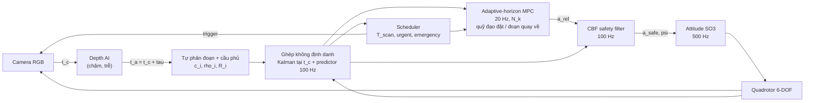

# DART-UAV

**DART — Delay-Aware, Risk-Triggered perception–control co-design** cho quadrotor tránh vật cản bằng monocular depth tần số thấp.
Mô phỏng hoàn toàn bằng **MATLAB/Simulink chạy trên cloud (GitHub Actions)** — không cần cài đặt hay chạy gì ở máy local.

> Tên cũ của dự án: `project1` (bản đề xuất "UAV Perception-Aware Adaptive MPC").
> Tên mới **DART** tóm tắt đúng đóng góp: bù **D**elay của AI, lập lịch perception kích hoạt theo **R**ủi ro (risk-**T**riggered), và horizon MPC thích nghi (**A**daptive).

| | |
|---|---|
| Phương pháp (bản 2, đã hiệu chỉnh) | [`docs/method/DART_method_VI.pdf`](docs/method/DART_method_VI.pdf) (nguồn LaTeX: [`DART_method_VI.tex`](docs/method/DART_method_VI.tex)) |
| Mô hình Simulink | sinh từ mã bởi [`simulink/dart_build_model.m`](simulink/dart_build_model.m) → `dart_closed_loop.slx` |
| Chạy trên cloud | tab **Actions** của repo: `CI`, `Experiments`, `Sweep`, `Debug case`, `Docs` |
| Kết quả | [`docs/results/random_worlds.md`](docs/results/random_worlds.md) (phương pháp hiện tại); các file khác trong `docs/results/` là của phiên bản cũ (có ghi chú ở đầu file) |

---

## 1. Ý tưởng

Mạng depth monocular chạy chậm (5–15 Hz) và trễ (50–200 ms) so với vòng điều khiển (100 Hz). DART:

**Phạm vi:** tránh **vật cản tĩnh** với chi phí tính toán thấp nhất (suy luận ảnh là phần tốn compute nhất). Thuật toán coi mọi vật là tĩnh; vật di chuyển chỉ có trong một phần **thế giới kiểm thử** (kết quả báo cáo riêng hai nhóm), và thuật toán không được báo thế giới nào có chúng.

0. **Không có "đáp án"**: UAV chỉ nhận ảnh depth của mạng; nó **tự phân đoạn** vật cản (vùng depth liên thông), biểu diễn mỗi vùng bằng một hoặc nhiều **hình cầu phủ** bề mặt (vật dài/dẹt như tường, cột bị chia), và **ghép với track không cần định danh** (cổng Mahalanobis + láng giềng gần nhất). Mỗi track là một **mốc tĩnh** (không ước lượng vận tốc); track ra khỏi trường nhìn được giữ làm **bộ nhớ trong 10 m** (`cfg.trk.forget_dist = 10`) — quên ngay (0 m) đã được thử và gây va chạm.
1. **Bù trễ**: mỗi ảnh được gắn thời điểm chụp `t_c`; phép đo được chuyển sang khung quán tính bằng pose tại `t_c` và cập nhật Kalman **tại `t_c`**, rồi dự đoán tới hiện tại. Với một inference engine (tối đa một frame đang xử lý) cách làm này *chính xác*, không xấp xỉ.
2. **Lập lịch perception theo an toàn**: khoảng quét `T_scan` được tính từ khoảng cách bảo thủ, tốc độ tiếp cận, khả năng phanh, độ trễ và độ bất định — có thêm ràng buộc **frontier** cho vật cản chưa nhìn thấy. Xa/chậm/chắc chắn → quét thưa; gần/nhanh/bất định → quét dày.
3. **MPC horizon thích nghi**: `N_k` lớn lên theo rủi ro (TTC), quãng phanh, và thời điểm có phép đo kế tiếp; ràng buộc vật cản được lồi hoá bằng nửa không gian tiếp tuyến (đủ an toàn) và tập kết thúc "dừng an toàn".
4. **Lớp an toàn CBF** ở 100 Hz với độ phồng bất định biến thiên theo thời gian. Mặc định là *braking-distance CBF* — dùng **cùng bất đẳng thức dừng** với scheduler; thêm giới hạn tốc độ khi đi vào vùng camera không nhìn thấy (lùi và trượt ngang ra ngoài trường nhìn).
5. **Quỹ đạo đặt và đoạn quay về**: UAV bám quỹ đạo đặt; khi quỹ đạo phía trước bị chặn, tham chiếu được vẽ lại thành **đường ngắn nhất không va chạm** tới điểm sớm nhất của quỹ đạo nằm sau đoạn bị chặn, và trong lúc quay về **không phạt sai lệch** khỏi quỹ đạo đặt. Camera nhìn tới vị trí dự đoán 0.6 s phía trước.
6. **Một siêu tham số κ ∈ [0, 1]** đánh đổi an toàn ↔ thời gian về đích (0 bảo thủ, 0.5 mặc định, 1 nhanh). **Không giới hạn thời gian**: thời gian về đích là kết quả đo; một lượt chỉ dừng khi về đích, va chạm, hoặc kẹt (không tiến thêm 1 m dọc quỹ đạo trong 60 s).



Danh sách đầy đủ các chỉnh sửa so với bản đề xuất (R1–R15) ở **Mục 1** của tài liệu phương pháp. Quy ước trong chú thích mã nguồn: "Eq. n" là số phương trình của bản đề xuất gốc, "method §n" là mục của tài liệu phương pháp; Phụ lục D ánh xạ phương trình → file.

## 2. Chạy trên cloud (GitHub Actions)

Mọi thứ chạy trên máy ảo của GitHub. Có năm workflow:

| Workflow | Kích hoạt | Làm gì | Kết quả |
|---|---|---|---|
| **CI** | tự động mỗi lần push | (a) *Octave*: toàn bộ unit test + 1 nhiệm vụ demo — **không cần license**; (b) *MATLAB + Simulink*: unit test, sinh model `.slx`, chạy vòng kín trong Simulink và so sánh chéo với MATLAB engine | Artifact `octave-results`, `matlab-simulink-results` (hình, `.slx`, `summary.md`) + bảng ở trang tóm tắt của run |
| **Experiments** | thủ công: *Actions → Experiments → Run workflow* | Monte-Carlo ablation: biến thể × kịch bản × seed (`all` = danh sách trong `dart_variant_list.m`); mỗi kịch bản một job song song. Chọn engine `matlab` / `simulink` / `octave` | Artifact `ablation-S1-…`: `runs.csv`, `summary.csv`, `summary.md`, `figures/*.png` |
| **Sweep** | thủ công | Quét một tham số (`latency`, `speed`, `rate`, `noise`, `shift`, `kappa`) qua danh sách giá trị; mỗi (kịch bản, giá trị) một job | Artifact `sweep-…`; log có dòng `FAILINFO` / `WORLD` cho phân tích lỗi |
| **Debug case** | thủ công | Chạy lại một ca (biến thể, kịch bản, seed, tham số quét) và in diễn biến những giây cuối | Log + artifact |
| **Docs** | khi `docs/**` thay đổi | Biên dịch tài liệu phương pháp bằng XeLaTeX | Artifact `DART-method-pdf` |

### 2.1. License MATLAB trên GitHub Actions (quan trọng)

GitHub Actions cài MATLAB/Simulink qua [`matlab-actions/setup-matlab`](https://github.com/matlab-actions/setup-matlab).

* **Repo public** (như hiện tại) → MathWorks cấp license tự động, không cần làm gì.
* **Repo private** → cần **batch licensing token**:
  1. Đăng ký token tại [MATLAB Batch Licensing Pilot](https://www.mathworks.com/support/batch-tokens.html) (cần tài khoản MathWorks có license MATLAB + Simulink, ví dụ license của trường).
  2. Vào *Settings → Secrets and variables → Actions → New repository secret*, tên **`MLM_LICENSE_TOKEN`**, dán token.
  3. Push bất kỳ — job *MATLAB + Simulink* sẽ chạy.

Khi chưa có license, job MATLAB của **CI** được **bỏ qua kèm cảnh báo**, còn job Octave vẫn chạy và kiểm tra toàn bộ thuật toán (cùng mã nguồn). Các workflow Experiments / Sweep / Debug case không có bước kiểm tra này: thiếu license thì chúng thất bại.

Phương án cloud khác: mở repo trong **MATLAB Online** (trình duyệt) → `dart_setup; run('ci/ci_matlab.m')`.

### 2.2. Chạy ablation

*Actions → Experiments → Run workflow*:

* `engine`: `matlab` (nhanh, khuyến nghị cho Monte-Carlo), `simulink` (dùng model Simulink cho từng lần chạy), `octave` (không cần license, chậm hơn ~3–5×)
* `seeds`: ví dụ `1:10`
* `variants`: `all` hoặc `A_FR_FN,E_DART,F_NODELAY`
* `scenarios`: `["S1","S2","S3"]` (hoặc `["SR"]` cho thế giới ngẫu nhiên)

Ví dụ đánh giá trên thế giới ngẫu nhiên ở nhiều tốc độ và mức κ (*Actions → Sweep*): `param = speed`, `values = [2, 4, 6, 8]`, `scenarios = ["SR"]`, `variants = K0,K50,K100`, `seeds = 1:30` (chia seed thành nhiều lần chạy để song song). Phân tích: `python3 docs/results/parse_failures.py <log>...`.

Tải artifact ở cuối trang run; bảng tổng hợp hiển thị ngay trong *Summary* của run.

## 3. Cấu trúc mã nguồn

```
dart_setup.m                  thêm đường dẫn
src/config/                   tham số mặc định, kịch bản S1–S3 và SR (ngẫu nhiên), biến thể, quét, siêu tham số κ
src/world/                    hình dạng vật cản (cầu, hộp, trụ), khoảng cách có dấu, clearance thật
src/plant/                    quadrotor 6-DOF, bộ điều khiển attitude SO(3) (codegen-compatible)
src/perception/               ray-casting, mạng depth tổng hợp, tự phân đoạn, cầu phủ, latency, message
src/estimation/               bộ đệm pose, ghép không định danh, Kalman tại thời điểm chụp, hai mô hình, quên track
src/planning/                 quỹ đạo đặt, đoạn bị chặn, chế độ BÁM / QUAY VỀ, đường vòng ngắn nhất
src/scheduling/               khoảng mở an toàn, frontier, sự kiện, urgent/emergency
src/control/                  horizon thích nghi, MPC (QP), CBF, yaw, bước điều khiển tích hợp
src/util/                     QP interior-point (thuần MATLAB), tiện ích hình học, RNG
sim/dart_sim.m                MATLAB engine (cùng hàm, cùng đa tần số với Simulink)
simulink/                     System objects + script sinh model + runner Simulink
experiments/                  chạy 1 ca, ablation Monte-Carlo, metric, phân loại thất bại, kiểm tra phân đoạn, hình
tests/                        unit test (chạy được trên MATLAB và Octave)
ci/                           điểm vào của các workflow
docs/method/                  tài liệu phương pháp (LaTeX, PDF)
docs/results/                 kết quả (markdown), log gốc (raw/), script phân tích parse_*.py
docs/figures/                 hình minh hoạ (bố trí vật cản, một khung perception)
docs/literature/              danh sách đọc, ghi chú đọc toàn văn, định vị tính mới
```

Model Simulink `dart_closed_loop.slx`:

| Khối | Loại | Tần số |
|---|---|---|
| Quadrotor 6DOF + Integrator | MATLAB Function (codegen) | liên tục, ode4 2 ms |
| Attitude Controller | MATLAB Function (codegen) | 2 ms |
| DART Controller (tracker, scheduler, MPC, CBF) | MATLAB System `DartControllerSys` (interpreted) | 10 ms (MPC 50 ms bên trong) |
| Camera + Depth AI | MATLAB System `DartPerceptionSys` (không direct feed-through) | 10 ms, theo sự kiện |
| Ground Truth Monitor → Stop (đích, va chạm, kẹt) | MATLAB System `DartMonitorSys` | 10 ms |

Model được sinh lại từ mã ở mỗi lần CI nên luôn khớp với mã nguồn; *đừng sửa tay file `.slx`*, hãy sửa `dart_build_model.m`.

## 4. Kịch bản và ablation

| Kịch bản | Mô tả |
|---|---|
| S1 | rừng cầu tĩnh theo 3 cụm dọc hành lang 50 m, xen vùng thoáng |
| S2 | vật cản tĩnh thưa + 6 vật cản cắt ngang (0.6–1.5 m/s) |
| S3 | hình học S1, perception chậm và nhiễu (inference 160 ms) |
| SR | **thế giới ngẫu nhiên theo seed**: quỹ đạo đặt 1–3 đoạn; bố trí rải / cụm / hành lang có tường / rừng cột / hỗn hợp; hình dạng cầu, hộp (mọi hướng, tấm mỏng tới khối), trụ, vật ghép; 60% thế giới có vật di chuyển 0.3–2 m/s; chạy ở nhiều tốc độ (quét `speed`). Mỗi lượt thất bại được phân loại nguyên nhân (`FAILINFO`, `docs/results/parse_failures.py`) |

| Biến thể | Perception | Horizon | Inflation + CBF + emergency | Bù trễ |
|---|---|---|---|---|
| A_FR_FN | cố định 10 Hz | cố định N=20 (≥ N_brake+1) | – | ✓ |
| B_AP_FN | thích nghi | cố định | – | ✓ |
| C_FR_AN | cố định 10 Hz | thích nghi | – | ✓ |
| D_AP_AN | thích nghi | thích nghi | – | ✓ |
| **E_DART** | thích nghi | thích nghi | ✓ | ✓ |
| F_NODELAY | thích nghi | thích nghi | ✓ | – |
| G_FR_LOW | cố định 3 Hz | thích nghi | ✓ | ✓ |

Thêm `Z_ZHUYI` (scheduler kiểu Zhuyi: không bất định, không frontier), `O_ORACLE` (perception "biết đáp án" như bản cũ: nhãn instance của ray-caster, ghép theo ID thật), `R_GOAL` (tham chiếu cũ thẳng tới đích, không có quỹ đạo đặt), `R_TRACK` (luôn bám quỹ đạo đặt, sai lệch luôn bị phạt), `R_STRAIGHT` (đoạn quay về là đoạn thẳng, không lập kế hoạch vòng), `K<k>` (E_DART với κ = k/100, ví dụ `K0`, `K50` ≡ E_DART, `K100`), `MEM<d>` (E_DART với bộ nhớ d m ngoài trường nhìn), `FR_SAFE_f` (đủ lớp an toàn, perception cố định f Hz) và `FN_SAFE_n` (horizon cố định n).

**Quỹ đạo đặt và đoạn quay về** (mặc định, `cfg.ref.mode = 'rejoin'`): UAV bám quỹ đạo đặt `world.path`; khi quỹ đạo phía trước bị vật cản chặn, tham chiếu được vẽ lại thành đường gấp khúc ngắn nhất không va chạm từ vị trí hiện tại tới điểm sớm nhất của quỹ đạo đặt nằm sau đoạn bị chặn, và trong lúc quay về sai lệch khỏi quỹ đạo đặt không bị phạt (`src/planning/`).

### Kết quả vòng 2 trên thế giới ngẫu nhiên SR (phiên bản trước khi thu hẹp về vật tĩnh)

> Vòng này chạy phiên bản còn theo dõi vật di chuyển; phương pháp hiện tại (chỉ vật tĩnh, mốc tĩnh, bộ nhớ 10 m) đang được đo lại.

120 thế giới ngẫu nhiên × 4 tốc độ × 3 mức κ = 1440 lượt (code `d3ed301`, MATLAB engine, không giới hạn thời gian). Chi tiết, phân loại nguyên nhân và log gốc: [`docs/results/random_worlds.md`](docs/results/random_worlds.md).

| κ | Về đích (2 / 4 / 6 / 8 m/s, mỗi ô 120 lượt) | Va chạm | Kẹt | Thời gian về đích, trung vị [s] |
|---|---|---|---|---|
| 0 (bảo thủ) | 110 / 112 / 110 / 112 | 1 / 4 / 2 / 3 | 9 / 4 / 8 / 5 | 62.7 / 39.2 / 31.7 / 33.0 |
| 0.5 (mặc định) | 102 / 108 / 107 / 110 | 18 / 12 / 13 / 10 | 0 | 42.8 / 30.5 / 27.1 / 30.1 |
| 1 (nhanh) | 98 / 103 / 104 / 103 | 22 / 17 / 16 / 17 | 0 | 40.5 / 28.4 / 24.9 / 27.9 |

Va chạm còn lại chủ yếu là với vật cản **tĩnh nằm ngoài trường nhìn** (48/53 ở κ = 0.5), khi đang quay về quỹ đạo, phần lớn là cột mảnh, do track trôi theo vận tốc ảo — cơ chế này không còn trong phương pháp hiện tại (mốc tĩnh).

### Kết quả của phiên bản cũ (50 seed mỗi cấu hình, khoảng tin cậy Wilson 95%)

> **Lưu ý:** các kết quả trong mục này là của phiên bản cũ (commit `3438b2b`): perception nhận nhãn instance thật từ ray-caster và ghép theo ID thật, tham chiếu thẳng tới đích, chỉ vật cản cầu, **giới hạn 40 s** (lượt quá giờ tính là thất bại — ví dụ cả 7/50 thất bại của Z_ZHUYI ở S3 đều là quá giờ), quét tốc độ chưa nới hộp vận tốc 5 m/s, chưa có giới hạn ra ngoài trường nhìn và yaw nhìn trước. Chúng **không** áp dụng cho phương pháp hiện tại.

Chi tiết và dữ liệu thô: [`docs/results/final_ablation_simulink.md`](docs/results/final_ablation_simulink.md) (Simulink, 1200 lượt) và [`docs/results/final_sweeps.md`](docs/results/final_sweeps.md) (quét tốc độ / độ trễ / sai số depth / horizon, 12 100 lượt).

| Phát hiện | Bằng chứng |
|---|---|
| Bù trễ (cập nhật tại thời điểm chụp) là bắt buộc | không bù trễ: 34/150 va chạm (Simulink), 206/900 trong các lượt quét |
| Lớp an toàn có xét bất định + bộ nhớ vật cản tĩnh quyết định an toàn | DART 0/150 va chạm, 150/150 về đích (Simulink); 2 Hz cố định + lớp an toàn: 1/900 va chạm, so với 10 Hz không có lớp an toàn: 25/900 |
| Bất định trong scheduler có ích so với scheduler tất định kiểu Zhuyi | S3: 0/50 vs 7/50 thất bại (p = 0.013); sai số depth lớn: 5/50 vs 25/50 |
| **Lập lịch thích nghi chưa thắng tần số cố định chọn hợp lý** | tần số cố định 2–5 Hz cũng gần như không thất bại; DART dùng 1.35–4.7× số suy luận của tần số cố định tốt nhất từng điều kiện, nhiệm vụ ngắn hơn 5–20% |
| Horizon thích nghi không đóng góp gì đo được | như horizon cố định 15/20/30 về an toàn, suy luận, thời gian |

Đánh giá trung thực về tính mới so với các công trình đã đọc toàn văn: [`docs/literature/novelty_positioning.md`](docs/literature/novelty_positioning.md).

## 5. Tuỳ biến

* Tham số: [`src/config/dart_default_config.m`](src/config/dart_default_config.m) (mọi tham số có chú thích, đơn vị SI).
* Kịch bản mới: thêm `case` trong [`src/config/dart_scenario.m`](src/config/dart_scenario.m).
* Biến thể mới: thêm `case` trong [`src/config/dart_apply_variant.m`](src/config/dart_apply_variant.m) và tên vào `dart_variant_list.m`.
* Dùng `quadprog` thay QP nội bộ: `cfg.mpc.solver = 'quadprog'` (cần Optimization Toolbox).
* Dùng HOCBF của bản đề xuất thay braking-CBF: `cfg.cbf.type = 'hocbf'`.
* Đánh đổi an toàn ↔ thời gian: `cfg.tradeoff.kappa` (0…1) hoặc biến thể `K<k>`. Sáu tham số `mpc.beta_s`, `cbf.alpha`, `sched.d_s`, `cbf.v_blind`, `cbf.v_blind_lat`, `ref.margin` được tính lại từ `cfg.tradeoff.nominal` trong `dart_apply_tradeoff` (gọi trong `dart_run_case`), nên muốn đổi chúng hãy đổi `cfg.tradeoff.nominal`.
* Không giới hạn thời gian: `cfg.sim.t_max = inf`; điều kiện kẹt `cfg.sim.stuck_window` / `stuck_dist`; `cfg.sim.t_cap` chỉ là giới hạn bảo vệ tài nguyên.

Trong MATLAB (cloud hoặc local):

```matlab
dart_setup;
res = dart_run_case('E_DART', 'S2', 1, 'simulink');   % hoặc 'matlab'
m = dart_metrics(res); dart_plot_run(res, 'run.png');
run_ablation('scenarios', {'S1'}, 'seeds', 1:5);       % ghi results/ablation
run_ablation('scenarios', {'SR'}, 'seeds', 1:5, 'variants', {'K0', 'K50'}, 'sweep', {'speed', 6});
```

## 6. Giới hạn hiện tại

* Mạng depth được thay bằng mô hình sai số tổng hợp trên ảnh depth ray-casting (không render RGB). UAV **không** nhận nhãn vật thể: tự phân đoạn ảnh depth và ghép track không định danh (`dart_segment_depth.m`, `dart_tracks_process_msg.m`); nhãn thật chỉ dùng để chấm điểm và cho biến thể đối chứng `O_ORACLE`. Phân đoạn giả định vật cản (kể cả tường, cột) nằm trước nền trống: mặt đất và nền phía sau không được render.
* Vật cản bất kỳ được phủ bằng hình cầu: bảo thủ với vật dẹt/dài; phần bị che chỉ biết khi nhìn thấy.
* Chỉ vật cản tĩnh: vật di chuyển chỉ được theo bằng phát hiện lại, không dự đoán chuyển động. Bộ nhớ vật cản 10 m (`MEM0` / `MEM3` / `MEM10` để so sánh).
* MPC là planner cục bộ: ở κ nhỏ có thể kẹt trước khe hẹp (khe 2 m bị đóng có chủ đích khi κ ≲ 0.15).
* CBF trên trạng thái ước lượng: an toàn mang tính xác suất qua hệ số `beta_s` (không bảo đảm qua bước nhảy lớn bất thường của cập nhật Kalman); khi độ phồng đang tăng, bảo đảm h ≥ 0 chỉ là mềm (slack).
* Hai engine (MATLAB / Simulink) cho quỹ đạo khác nhau sau một quyết định rời rạc (hệ hỗn loạn sát biên); kết luận an toàn được phát biểu ở dạng thống kê.
* Phân loại nguyên nhân thất bại cần trạng thái bộ điều khiển lúc kết thúc nên chỉ đầy đủ với MATLAB engine.
* Chỉ mô phỏng. Kết luận cũ (code `3438b2b`) rằng tần số perception cố định thấp vẫn an toàn được rút ra ở S1–S3 (tầm 15 m, ≤ 6 m/s); chưa kiểm lại trên thế giới ngẫu nhiên và tốc độ 8 m/s.

Chi tiết và các mệnh đề lý thuyết: Mục 13 của tài liệu phương pháp.
